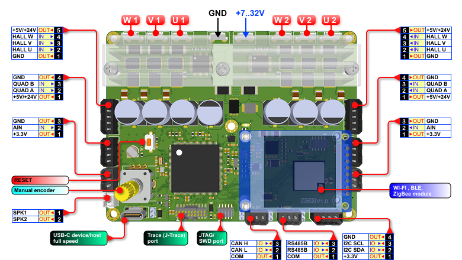
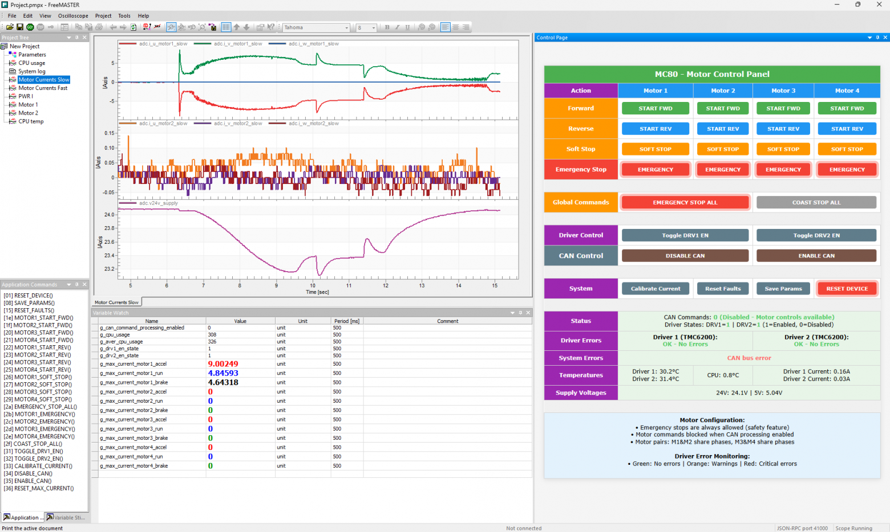
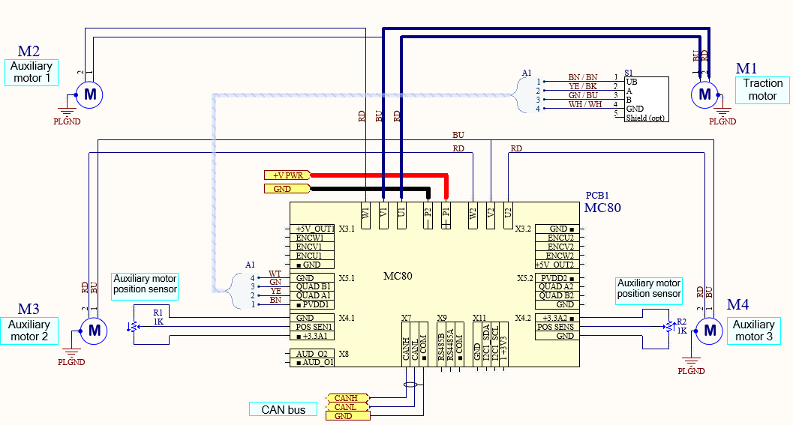

# MC80_4DC - Four-Channel DC Motor Controller

An experimental high-performance four-channel DC motor controller based on Renesas RA8M1 microcontroller with advanced motion control algorithms and comprehensive filesystem support.

## 📋 Project Overview

MC80_4DC is an experimental DC motor controller designed for precision motion control applications. The project demonstrates advanced embedded systems programming with real-time operating system integration, high-speed communication interfaces, and motor control with analog position feedback.

**⚠️ Note: This is an experimental project under active development. Some features may be incomplete or subject to change.**

### Key Features

- **Four Independent DC Motor Channels** with individual control
- **Analog Position Feedback**: High-precision analog sensors for position monitoring
- **High-Performance MCU**: Renesas RA8M1 (ARM Cortex-M85, 480MHz)
- **Real-Time Operating System**: Azure RTOS ThreadX integration
- **Storage Solutions**:
  - **exFAT filesystem** on SD card for data logging and configuration
  - **Custom OSPI driver** for external flash memory (under development)
- **Communication Interfaces**: CAN 2.0 for industrial applications
- **Development Environment**: Visual Studio Code for code editing, IAR Embedded Workbench 9.70 for compilation
- **Comprehensive Debug Support**: RTT logging, VT100 terminal interface, SWD/JTAG debug interfaces, and hardware trace

## 🎯 Applications

The MC80_4DC motor controller is designed for a wide range of automation and motion control applications:

- **Multi-leaf Automatic Doors**: Precise control of synchronized door panels
- **3D Rotating Platforms**: Solar panel tracking systems and antenna positioning
- **Automated Blinds and Awnings**: Smart building automation and shading systems
- **Gate and Barrier Control**: Access control systems and parking barriers
- **Stair Lifts**: Mobility assistance and accessibility solutions
- **Industrial Automation**: Various precision motion control applications

## 🛠 Hardware Platform

### Main Controller
- **MCU**: Renesas RA8M1AH3GT (ARM Cortex-M85, 480MHz)
- **Internal Flash**: 2MB
- **External Flash Memory**: MX25UM25645GMI00 (256Mbit OSPI)
- **RAM**: 1MB internal SRAM
- **Package**: LQFP176

### Pinout Diagram

### Motor Control System
- **Channels**: 4 independent DC motor drivers
- **Servo Sensors**: 2 analog inputs for servo sensor feedback
- **Quadrature Encoders**: 2 interfaces for incremental position encoders
- **Hall Sensors**: 2 interfaces for 3-phase Hall sensor inputs
- **Analog Inputs**: Equipped with differentiator for low speed measurement
- **Current Monitoring**: Real-time current sensing capabilities
- **PWM Generation**: High-frequency PWM for motor control

### Storage and Communication
- **SD Card**: exFAT filesystem for data storage
- **CAN 2.0**: Industrial communication protocol
- **USB**: Device and host support

### Debug and Programming Interfaces
- **SWD**: Serial Wire Debug interface for programming and debugging
- **Trace**: Hardware trace interface for real-time debugging

## 🎮 Control Methods

The MC80_4DC board supports multiple control interfaces for different operational scenarios:

### Development and Testing
- **USB Control Software**: Specialized control and monitoring software for PC-based testing and debugging
- **Terminal Programs**: Direct control via USB using standard terminal applications
- **Debug Interface**: Full development support through SWD and trace interfaces

### Production Operation
- **CAN Bus Control**: Primary control interface for industrial applications
- **Real-time Communication**: Deterministic control through CAN 2.0 protocol
- **Distributed Systems**: Integration into larger automation networks

## 🏗 Software Architecture

### Real-Time Operating System
The project is built on **Azure RTOS ThreadX**, providing:
- Preemptive multitasking
- Real-time scheduling
- Inter-thread communication
- Memory management
- Timer services

### Motor Control Architecture
DC motor control system featuring:
- **Analog Sensor Interface**: Multi-channel ADC for position feedback
- **Current Monitoring**: Real-time current sensing and monitoring
- **PWM Control**: Hardware-generated PWM signals for motor driving

### Filesystem Integration
Advanced storage solution using **exFAT** on SD card:
- FAT32-compatible filesystem
- Long filename support
- Efficient storage management
- Configuration file storage
- Data logging capabilities

### Custom OSPI Driver (Under Development)
High-performance OSPI flash driver featuring:
- Memory-mapped access capabilities
- DMA-based transfers for maximum throughput
- Protocol switching (SPI ↔ Octal DDR)
- Comprehensive error handling
- **Note**: Driver development is ongoing

## 🏃‍♂️ Real-Time Performance

### Task Architecture
- **Motor Control Task**: Real-time motor control operations
- **Sensor Processing Task**: ADC data acquisition and processing
- **Communication Task**: Handle CAN 2.0 communication
- **Filesystem Task**: Background file operations on SD card
- **Monitor Task**: System health monitoring and diagnostics

### Timing Characteristics
- **Sensor Sampling**: High-frequency ADC conversion
- **Interrupt Response**: <5μs average interrupt latency
- **Task Switching**: <1μs context switch time
- **File Operations**: SD card access with optimized buffering

## 📄 License

This project is licensed under the MIT License - see the [`LICENSE`](LICENSE ) file for details.

## 🔌 Board Connections

**MC80_4DC** - Experimental DC motor control with precision analog feedback.

---

⚠️ **Disclaimer**: This is an experimental project. Use at your own risk in production environments.
