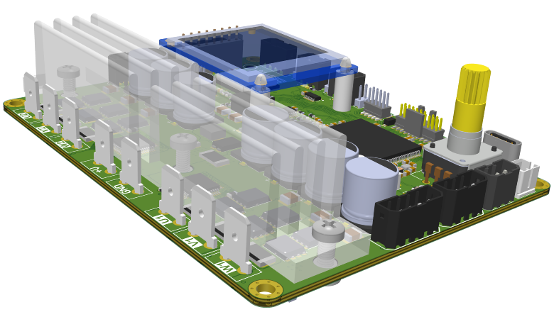

# MC80_4DC - 4-канальный контроллер электродвигателей

## Описание проекта

MC80_4DC - это современный 4-канальный контроллер электродвигателей, основанный на микроконтроллере Renesas RA8M1 и операционной системе реального времени Azure RTOS (ThreadX). Контроллер предназначен для прецизионного управления бесщеточными двигателями постоянного тока с использованием драйверов TMC6200.

## Внешний вид устройства


*Рендер MC80_4DC: 4-канальный контроллер электродвигателей*

## Основные характеристики

- **Микроконтроллер**: Renesas RA8M1AH (ARM Cortex-M85, 480 МГц)
- **Количество каналов**: 4 независимых канала управления двигателями
- **Драйверы двигателей**: TMC6200 (интеллектуальные драйверы BLDC)
- **Операционная система**: Azure RTOS ThreadX
- **Интерфейсы**: CAN, USB, UART
- **Память**: OSPI Flash память для хранения данных
- **Пользовательский интерфейс**: GUIX GUI система
- **Мониторинг**: FreeMaster для отладки и настройки

## Функциональные возможности

### Управление двигателями
- Независимое управление 4 бесщеточными двигателями постоянного тока
- Мягкий старт двигателей с настраиваемыми параметрами
- Мониторинг состояния драйверов TMC6200
- Система защиты от перегрузок и коротких замыканий

### Интерфейсы связи
- **CAN-интерфейс**: Для интеграции в промышленные сети
- **USB**: Для программирования и диагностики
- **FreeMaster**: Для настройки параметров и мониторинга в режиме реального времени

### Система хранения данных
- Файловая система LittleFS для энергонезависимого хранения настроек
- Система параметров с возможностью сохранения в OSPI Flash
- Журналирование событий и ошибок

### Пользовательский интерфейс
- GUIX-интерфейс для локального управления
- VT100-совместимый терминальный интерфейс
- LED-индикация состояния системы

## Структура проекта

```
MC80_4DC/
├── src/                    # Исходный код приложения
│   ├── App.h              # Главный заголовочный файл
│   ├── MC80.h             # Конфигурация проекта MC80
│   ├── Board/             # Конфигурация платы
│   ├── CAN/               # CAN-интерфейс
│   ├── Motor_Driver_task/ # Управление двигателями
│   ├── TMC6200_Monitoring_task/ # Мониторинг TMC6200
│   ├── GUIX/              # Графический интерфейс
│   ├── FreeMaster/        # FreeMaster интерфейс
│   ├── FileSystem/        # Файловая система
│   ├── Parameters/        # Система параметров
│   └── ...
├── Doc/                   # Документация
│   ├── Img/              # Изображения и схемы
│   └── ...
├── ra/                    # Конфигурация Renesas
├── ra_cfg/               # Настройки периферии
└── script/               # Скрипты сборки
```

## Требования к среде разработки

- **IDE**: IAR Embedded Workbench для ARM
- **SDK**: Renesas FSP (Flexible Software Package)
- **Отладчик**: J-Link или встроенный отладчик
- **ОС**: Windows 11 (рекомендуется)
- **Редактор**: Visual Studio Code

## Сборка проекта

1. Установите IAR Embedded Workbench для ARM
2. Установите Renesas FSP
3. Откройте проект `MC80_4DC_Proj.eww` в IAR EWARM
4. Выберите конфигурацию сборки (Debug/Release)
5. Соберите проект (F7)

## Программирование

Для программирования контроллера используйте один из способов:

1. **Через IAR EWARM**: 
   - Подключите J-Link отладчик
   - Запустите отладку (Ctrl+D)

2. **Через командный файл**:
   ```cmd
   Flash_MC80_4DC.cmd
   ```

3. **Через J-Flash**:
   - Используйте файл `R7FA8M1AH.jflash`

## Настройка и калибровка

### FreeMaster
Используйте FreeMaster для:
- Настройки параметров двигателей
- Мониторинга сигналов в режиме реального времени
- Отладки алгоритмов управления

### Параметры системы
Основные параметры конфигурируются через:
- Графический интерфейс GUIX
- FreeMaster интерфейс
- VT100 терминал

## Схемы подключения

Подробные схемы подключения и распиновка доступны в папке `Doc/Img/`:
- `MC80_Connections.png` - Схема подключений
- `MC80_Pinout_Diagram.png` - Распиновка контактов
- `MC80_PCB_3D_stackup.png` - 3D вид печатной платы

## Техническая поддержка

Для получения технической поддержки обратитесь к документации в папке `Doc/` или воспользуйтесь системой Issues данного репозитория.

## Лицензия

Данный проект распространяется под лицензией, указанной в файле `LICENSE`.